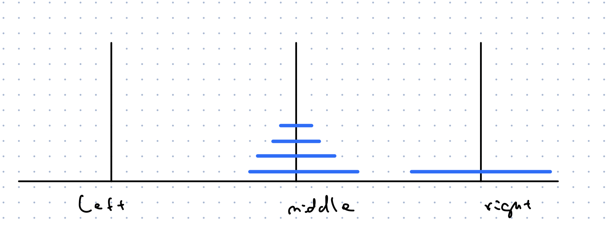

# Recursion 

The basic idea is that you want to solve an instance of a problem but to solve it we break down into smaller instances of the same problem and
give it to what we call the *recursion fairy*, or solve it by brute force it is constant sized.

### Tower of Hanoi 

A pyhsical puzzle designed in the late 1800s by the French mathematician Edward Lucas. 

There are three pegs and on one of them, there is a stack of circular discs of different sizes stacked up so that the size increase from top 
to bottom.
<br/>


Goal: Move all disc from left to the right peg by following these rules:
  1. We can only move one disc at a time
  2. A disc can only be on top of a larger disc

How do we do this? 

Here is how we are going to think about it. 

We want to move the bottom most disc to a different peg. In order to do this, we have to get the other discs out of the way.
This is the same problem with one less disc 


**Step 1** Recursion fairy solves it 

We can assume that the recursion fairy solves the smaller problem and our only job now is move the largest 
disc to the right peg.



**Step 2** Our job 


**Step 4** Recursion Fairy solves it 

The algorithm formally to move $n$ discs from source (src) to destination (dst) peg using a temporary (tmp) peg is as follows.

```bash
Hanoi(n, src, dst, tmp)
  if n > 0
    Hanoi(n-1, src, tmp, dst)
    Move disc n from src to dst
    Hanoi(n-1, tmp, dst, src)
```

What about the base case? 
There has to be a largest disc, so $n$ has to be a positive integer, otherwise it does not make sense ti call `Hanoi(n-1,...)`

This means that if the condition $n > 0$ is violated, we have to solve the only remaining case of $n = 0$ differently. But in 
this case, there are no discs, so there is nothing to do and the algorithm above will work.

Advice: Believe in the recursion fairy and check assumptions about boundary cases. 
